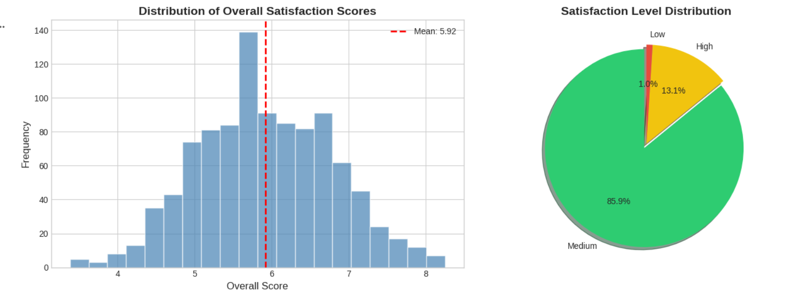
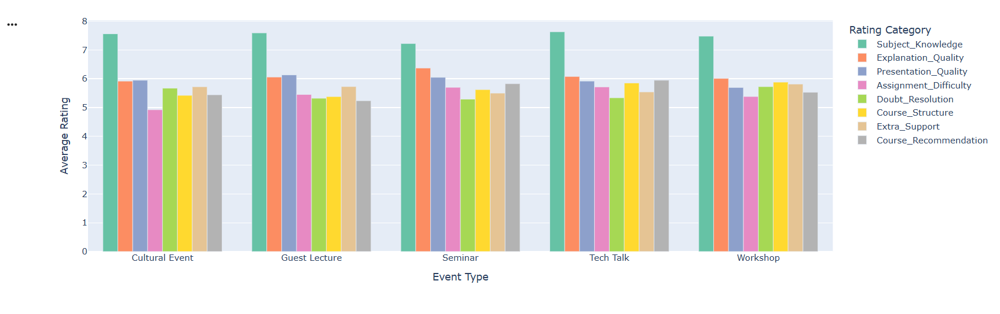
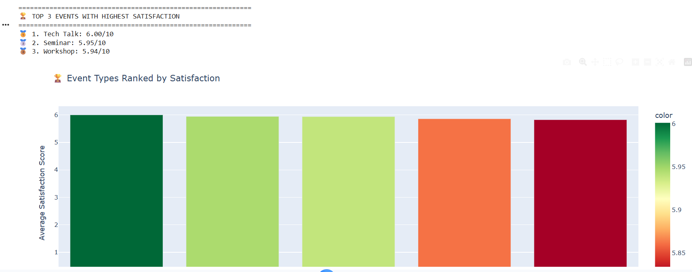
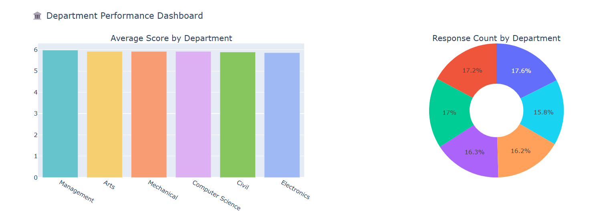
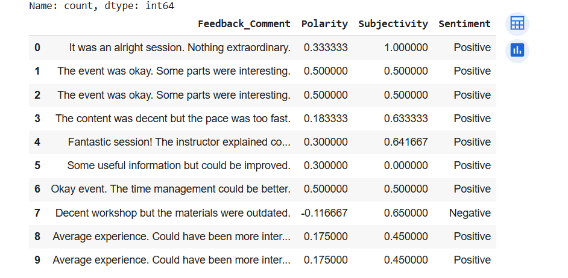
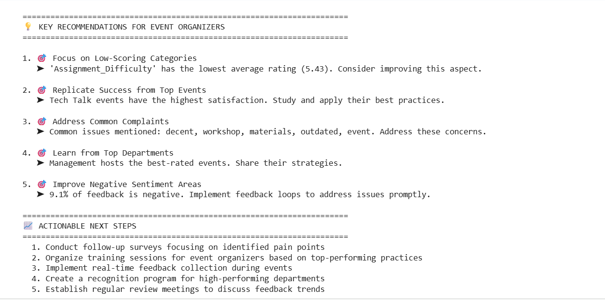

# 🎓 Student Feedback Analysis for Campus Events

[](https://www.python.org/downloads/)
[](https://jupyter.org/)
[](https://colab.research.google.com/)
[](LICENSE)


> A comprehensive data analysis project that analyzes text and rating-based feedback submitted by students after attending campus events using Natural Language Processing (NLP) techniques.

---

## 📋 Table of Contents

- [Overview](#-overview)
- [Features](#-features)
- [Dataset](#-dataset)
- [Installation](#-installation)
- [Analysis Performed](#-analysis-performed)
- [Screenshots](#-screenshots)
- [Key Insights](#-key-insights)
- [Technologies Used](#-technologies-used)
- [Deliverables](#-deliverables)
- [Author](#-author)

---

## 🎯 Overview

This project analyzes student feedback from campus events to understand satisfaction levels and identify areas for improvement. Using data from Google Forms exports (CSV format), we apply:

- **Data Cleaning & Preparation** - Transform raw feedback data into analyzable format
- **Rating Analysis** - Identify patterns in 1-10 scale ratings
- **Sentiment Analysis** - Score comments as positive, neutral, or negative using NLP
- **Visualization** - Create beautiful, interactive charts and dashboards
- **Recommendations** - Provide actionable insights for event organizers

---

## ✨ Features

| Feature | Description |
|---------|-------------|
| 📊 **Rating Analysis** | Comprehensive analysis of numerical ratings across multiple categories |
| 💬 **Sentiment Analysis** | NLP-powered sentiment scoring using TextBlob |
| ☁️ **Word Clouds** | Visual representation of common words in feedback |
| 📈 **Interactive Dashboards** | Plotly-powered interactive visualizations |
| 🏆 **Top Events Ranking** | Identify best-performing events and departments |
| 📋 **Executive Summary** | Auto-generated insights and recommendations |

---

## 📊 Dataset

**Input:** `student_feedback.csv` - 1,002 student responses with 8 rating categories

| Column | Description | Scale |
|--------|-------------|-------|
| Student ID | Unique identifier | - |
| Subject Knowledge | How well-versed with the subject | 1-10 |
| Explanation Quality | Explains concepts understandably | 1-10 |
| Presentation Quality | Use of presentations | 1-10 |
| Assignment Difficulty | Degree of difficulty | 1-10 |
| Doubt Resolution | Solves doubts willingly | 1-10 |
| Course Structure | Structuring of the course | 1-10 |
| Extra Support | Support for students going above | 1-10 |
| Course Recommendation | Recommendation based on relevance | 1-10 |

**Output:** `enriched_student_feedback.csv` - Original data + sentiment scores

---

## 🛠️ Installation

### Option 1: Google Colab (Recommended)

1. Open [Google Colab](https://colab.research.google.com/)
2. Upload `Student_Feedback_Analysis.ipynb`
3. Run all cells - dependencies install automatically!

### Option 2: Local Installation

```bash
# Clone the repository
git clone https://github.com/Vedag812/FUTURE_DS_03.git
cd FUTURE_DS_03

# Install required packages
pip install pandas numpy matplotlib seaborn plotly wordcloud textblob nltk scikit-learn

# Download NLTK data
python -c "import nltk; nltk.download('punkt'); nltk.download('stopwords'); nltk.download('wordnet')"

# Launch Jupyter Notebook
jupyter notebook Student_Feedback_Analysis.ipynb
```

---

## 📊 Analysis Performed

### 1. Rating Analysis
- Overall score distribution
- Average ratings by category
- Event type comparison
- Department-wise performance
- Correlation between rating categories

### 2. Sentiment Analysis (NLP)
- Polarity scoring (-1 to +1)
- Subjectivity analysis (0 to 1)
- Sentiment categorization (Positive/Neutral/Negative)
- Sentiment by event type

### 3. Word Cloud Analysis
- All feedback visualization
- Positive feedback keywords
- Common complaints identification

### 4. Comparative Analysis
- Workshop vs Seminar comparison
- Top 3 events by satisfaction
- Best performing departments

---

## 📸 Screenshots

### 📊 Overall Satisfaction Score Distribution
*Distribution of satisfaction scores (Mean: 5.92/10) with satisfaction level breakdown showing 85.9% Medium, 13.1% High, and 1.0% Low satisfaction*



---

### 📈 Rating Comparison Across Event Types
*Detailed breakdown of all 8 rating categories across Cultural Events, Guest Lectures, Seminars, Tech Talks, and Workshops*



---

### 🏆 Top 3 Events with Highest Satisfaction
*Event rankings: 🥇 Tech Talk (6.00/10), 🥈 Seminar (5.95/10), 🥉 Workshop (5.94/10)*



---

### 🏛️ Department Performance Dashboard
*Average scores and response distribution across 6 departments: Management, Arts, Mechanical, Computer Science, Civil, and Electronics*



---

### 💬 Sentiment Analysis Summary
*NLP-powered sentiment analysis showing distribution of Positive, Neutral, and Negative feedback with polarity and subjectivity scores*



---

### 💡 Key Recommendations for Event Organizers
*Data-driven actionable insights including focus areas, success replication strategies, and improvement suggestions*



---

## 💡 Key Insights

Based on the analysis of **1,002 student responses**:

| Insight | Details |
|---------|---------|
| 🏆 **Top Event** | Tech Talk with highest satisfaction (6.00/10) |
| 🏛️ **Best Department** | Management leads in event satisfaction |
| 📊 **Overall Satisfaction** | Mean score of 5.92/10 |
| 😊 **Sentiment Breakdown** | Majority positive/neutral feedback |
| 📉 **Areas to Improve** | Extra Support & Course Structure rated lowest |
| 💬 **Common Complaints** | Poor organization, technical issues, boring sessions |

---

## 🔧 Technologies Used

| Category | Technologies |
|----------|-------------|
| **Data Processing** | Pandas, NumPy |
| **Visualization** | Matplotlib, Seaborn, Plotly |
| **NLP** | TextBlob, NLTK |
| **Word Cloud** | WordCloud |
| **Environment** | Jupyter Notebook, Google Colab |

---

## 📦 Deliverables

### ✅ Jupyter Notebook (Google Colab Ready)
- Fully documented code with markdown explanations
- 30+ cells covering complete analysis pipeline
- Interactive Plotly visualizations
- Auto-installs all dependencies in Colab

### ✅ Mini-Report/Dashboard with:
| Component | Description |
|-----------|-------------|
| 📊 **Rating Graphs** | Histograms, bar charts, pie charts, heatmaps, box plots |
| 💭 **Sentiment Analysis** | TextBlob NLP with polarity & subjectivity scores |
| 💡 **Recommendations** | 5 actionable insights + next steps for organizers |

### ✅ Enriched Dataset
New columns added: `Event_Type`, `Department`, `Overall_Score`, `Satisfaction_Level`, `Feedback_Comment`, `Polarity`, `Subjectivity`, `Sentiment`

---

## 👨‍💻 Author

**Vedag812 - Future Intern Task 3**

| | |
|---|---|
| **Project** | Student Feedback Analysis for Campus Events |
| **Dataset** | 1,002 student responses with 8 rating categories |
| **GitHub** | [github.com/Vedag812/FUTURE_DS_03](https://github.com/Vedag812/FUTURE_DS_03) |

### What Was Accomplished:
1. Cleaned and prepared raw feedback data from Google Forms export
2. Analyzed 8 rating categories across 1,002 responses
3. Identified top-performing events (Tech Talk, Seminar, Workshop)
4. Compared department performance (Management leading)
5. Performed NLP sentiment analysis on feedback comments
6. Created word clouds to identify common complaints
7. Built interactive dashboards with Plotly
8. Generated actionable recommendations for event organizers
9. Exported enriched dataset with sentiment scores

---

##  Acknowledgments

- TextBlob for sentiment analysis
- Plotly for interactive visualizations
- NLTK for natural language processing
- WordCloud for text visualization

---

<p align="center">
  Made for Future Intern Internship
</p>
